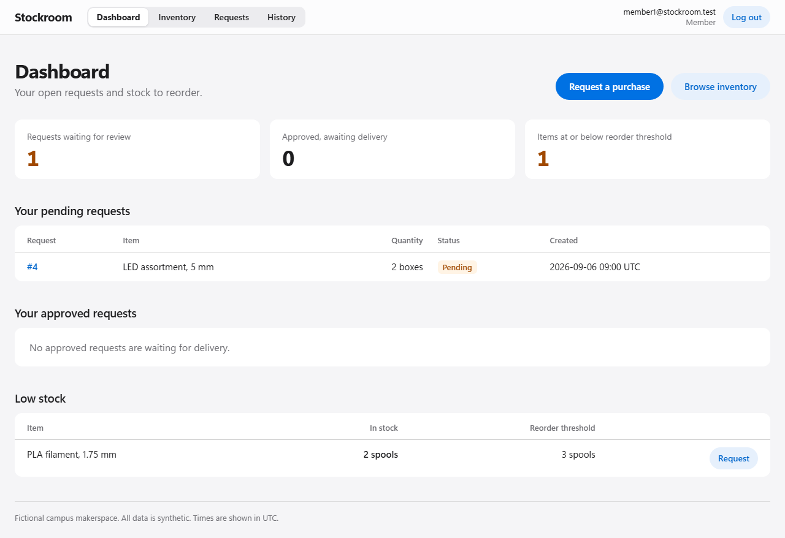
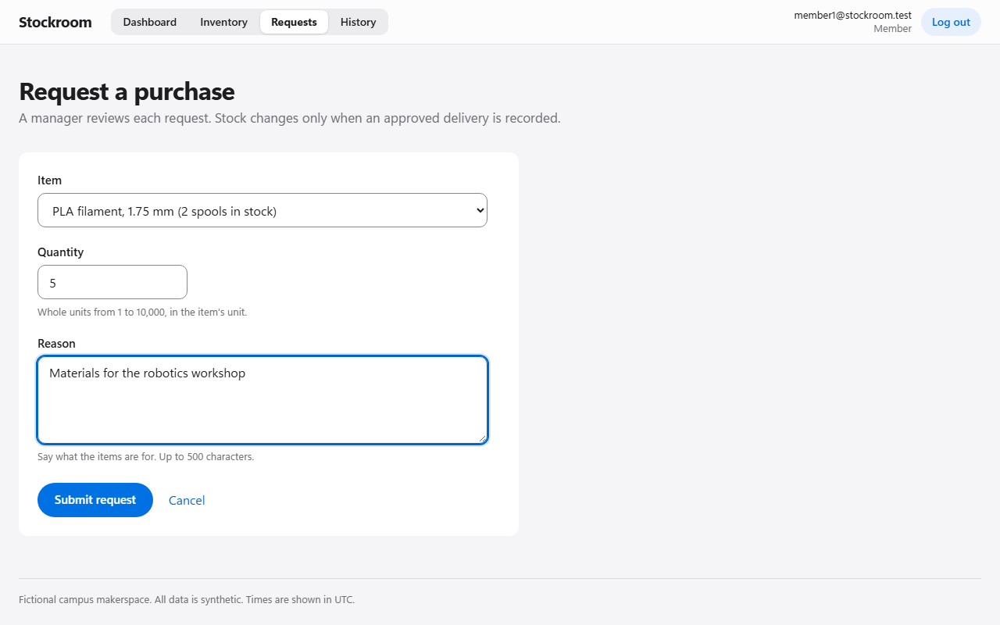
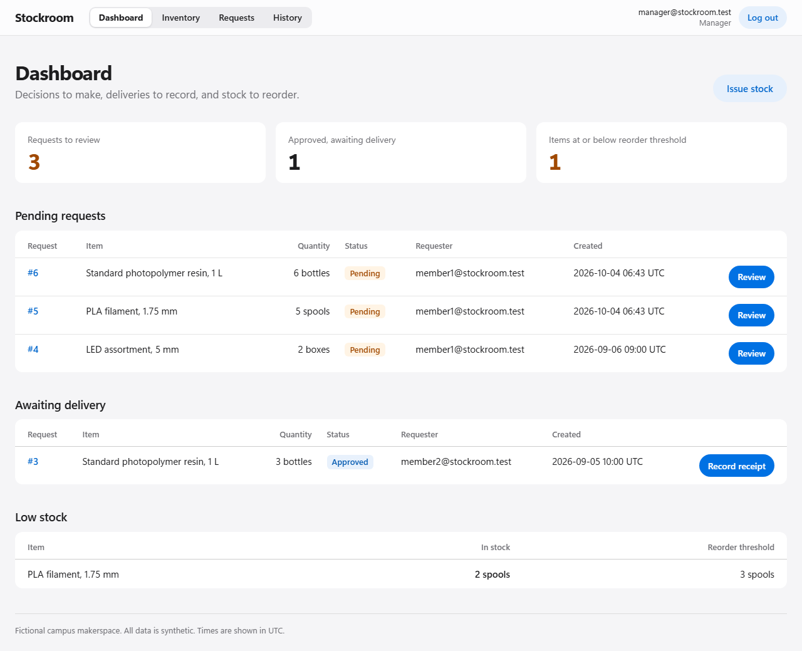
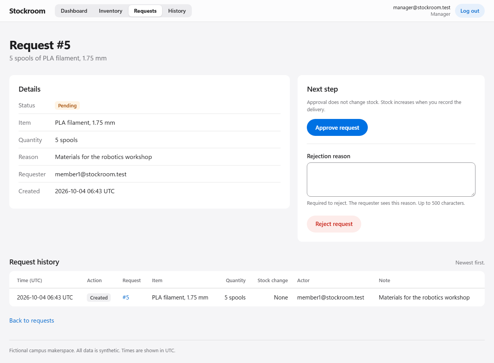
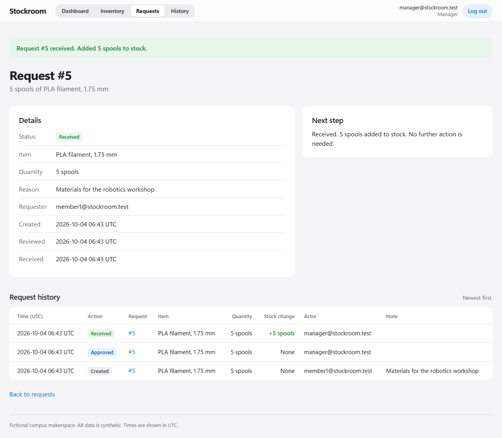
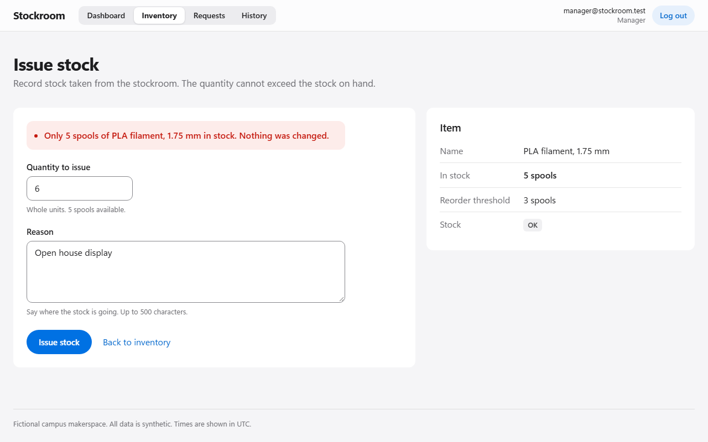
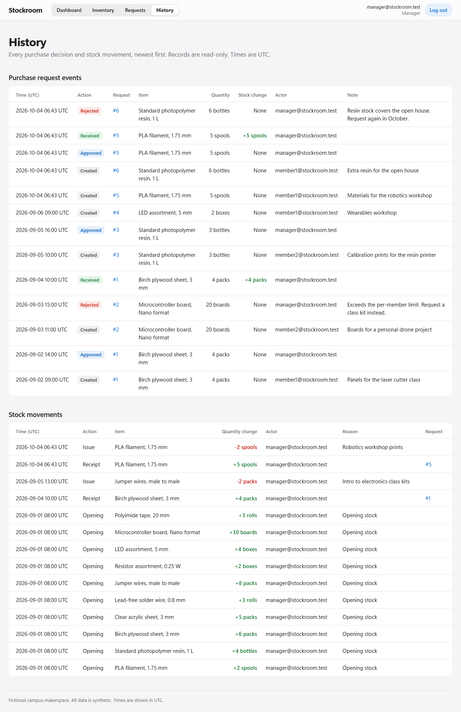
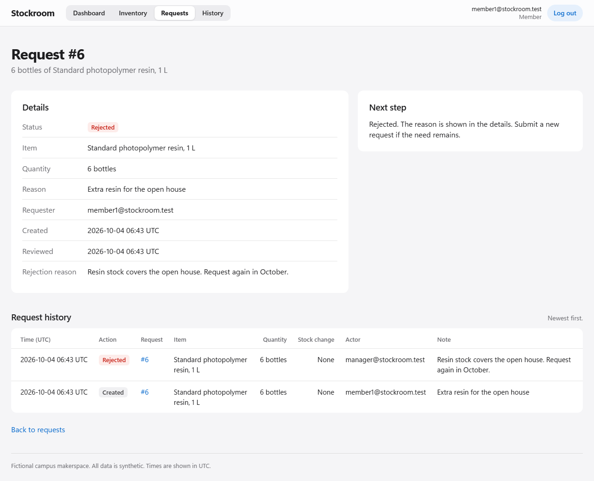

# Stockroom

Members request supplies for a fictional campus makerspace. Managers review purchase requests, record deliveries, issue stock, and trace every change. The application uses C#, ASP.NET Core Razor Pages, Entity Framework Core, and SQLite. All data is synthetic; the author has no client deployment or production usage to report.

## Status

Milestones M1 through M7 are implemented. The working tree adds the M8 interface polish ([ADR 0008](docs/decisions/0008-m8-ui-polish.md)), which awaits review. Members log in, browse and search inventory, see low-stock items, submit purchase requests, and read the history of their own requests. The manager approves or rejects pending requests, records receipts, issues stock with a reason, and reads the full request and stock-movement history.

Receipts and issues save the stock change and its movement in one transaction. Conditional writes stop competing operations from adding stock twice or overselling. Database failures show a controlled message or error page and leave diagnostic details in the server log. A Development seed command creates a synthetic dataset with one request in each status, and `seed --reset` recreates it.

One hundred and fifty-six SQLite integration tests and eleven Chromium browser tests pass locally on Windows. They cover roles in pages and services, request ownership, validation, duplicate and competing operations, overflow, lock retries, rollback, controlled database errors, history, restart persistence, seed reruns, reset, the purchase, rejection, withdrawal, and access workflows in a browser, and phone-width layout without sideways scrolling, clipped values, or CSP errors, and keyboard focus that the sticky header never covers. Hosted CI run 37176807154 passed every job for the M6 commit, and the owner reports that hosted CI passed for the merged M7 changes. The M8 changes have not run in hosted CI.

## Security

The [security review](docs/security-review.md) audited the M6 commit, recorded 16 findings (no Critical or High), and tracks their status. M7 added security headers, logout that revokes copied sessions, immediate role changes, and login throttling ([ADR 0007](docs/decisions/0007-m7-security-hardening.md)). Branch protection for `main` and hosting controls such as HTTPS remain open.

## Demonstration

The screenshots come from a freshly seeded database and were captured by an automated browser walkthrough (`DemoRecording` in [tests/e2e](tests/e2e/README.md)). Accounts use the reserved `.test` domain. The interface follows the system light or dark setting and works at phone width: list tables become cards and history tables scroll inside their frame. [ADR 0008](docs/decisions/0008-m8-ui-polish.md) shows before-and-after comparisons.

1. **Member dashboard.** Filament has two spools against a reorder threshold of three, so it appears under low stock.
   
2. **Purchase request.** The member requests five spools with a reason.
   
3. **Manager review.** The manager sees pending requests and opens the filament request.
   
   
4. **Approval and receipt.** Approval leaves stock at two. Receipt adds five spools once and records the event.
   
5. **Withdrawal.** The manager issues two spools, leaving five, then tries to issue six. The application refuses and changes nothing.
   
6. **History.** Request events and stock movements show actor, UTC time, quantity change, reason, and request reference. Movements reconcile with stock.
   
7. **Rejection.** A second request is rejected with a reason, which the member sees on the request page.
   

The same walkthrough restarts the application before step 7 and confirms that stock and history persist.

## Run locally

Install the .NET 10 SDK and PowerShell 7, then follow [development setup](docs/development.md). In short: restore, set the two demo passwords with `dotnet user-secrets`, run `dotnet run --project src/Stockroom.Web -- seed`, start the application with `dotnet run --project src/Stockroom.Web --launch-profile http`, and open `http://localhost:5080`.

## Checks

Run these commands from the repository root with PowerShell 7:

```powershell
pwsh -NoProfile -File scripts/Test-Repository.ps1
pwsh -NoProfile -File scripts/Test-Dependencies.ps1
dotnet build Stockroom.slnx --configuration Release --no-restore --warnaserror
dotnet test --project tests/integration/Stockroom.IntegrationTests.csproj --configuration Release --no-build
pwsh tests/e2e/bin/Release/net10.0/playwright.ps1 install chromium
dotnet test --project tests/e2e/Stockroom.E2ETests.csproj --configuration Release --no-build
```

The repository check covers required files, text formatting, and local Markdown file links. GitHub Actions shows separate jobs for repository checks, dependency auditing, the Release build, integration tests on Ubuntu and Windows, and Chromium browser tests on Ubuntu. Each test run uploads its report. The final `CI Status` check requires every job to pass. A unit-test job will be added when that project contains cases.

## Known limitations

- The application targets a local demonstration. It has no hosting configuration, HTTPS redirection, or HSTS.
- `seed --reset` deletes the database before reseeding. If seeding failed after deletion, the database would stay empty until the next reset; an atomic replacement is deferred.
- Item administration, multi-item orders, partial receipts, cancellations, stock corrections, suppliers, email, registration, and password recovery are outside the MVP.
- Times display in UTC. History and request lists have no paging.
- On phones, history tables scroll sideways inside their frame. A blank rejection reason is reported in the page alert, not beside the field.
- Logout ends every session for the account. Login allows five attempts per client address per one-minute sliding window; because the window frees attempts in 10-second segments, up to 10 can fit within one minute. Starting from no failed attempts, a persistent caller can lock an account after about 100 seconds, and sooner if earlier failures remain. An active session renews without an absolute time limit.

## Project documents

Start with the [documentation index](docs/README.md).

| Document | Purpose |
| --- | --- |
| [MVP](docs/mvp.md) | Release scope and business rules |
| [Personas](docs/personas.md) | Users, responsibilities, and access |
| [User stories](docs/user-stories.md) | Acceptance criteria and evidence |
| [Architecture](docs/architecture.md) | Application structure and data model |
| [Delivery plan](docs/delivery-plan.md) | Milestones, estimates, and SDLC checkpoints |
| [Definition of done](docs/definition-of-done.md) | Evidence required before release |
| [Test plan](docs/test-plan.md) | Acceptance scenarios, coverage map, and demo procedure |
| [Development setup](docs/development.md) | Prerequisites, setup, reset, and CI |
| [Test structure](tests/README.md) | Unit, integration, E2E, and fixture responsibilities |
| [Dependency audit](docs/dependency-audit.md) | Package versions and vulnerability-check evidence |

Read [CONTRIBUTING.md](CONTRIBUTING.md) before making changes.

## Community

Use [the code of conduct](CODE_OF_CONDUCT.md) for community participation, [support guidance](SUPPORT.md) for questions, and [the security policy](SECURITY.md) for private vulnerability reports. The owner licenses this project under the [MIT license](LICENSE).
