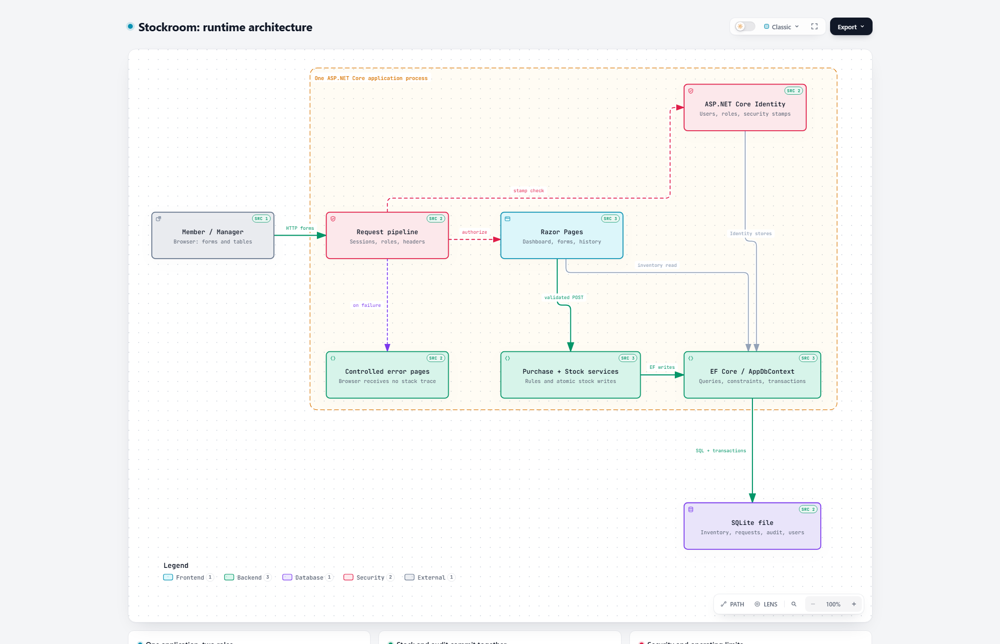
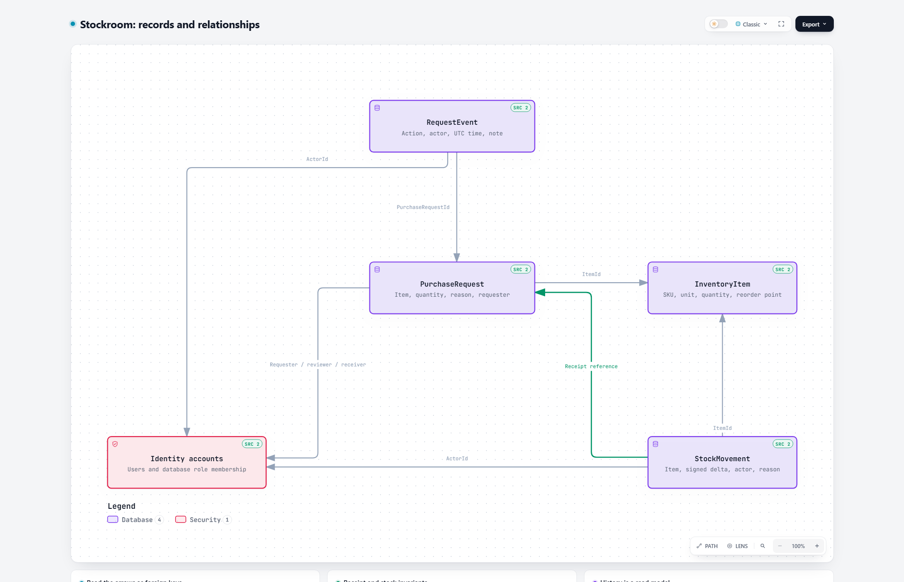
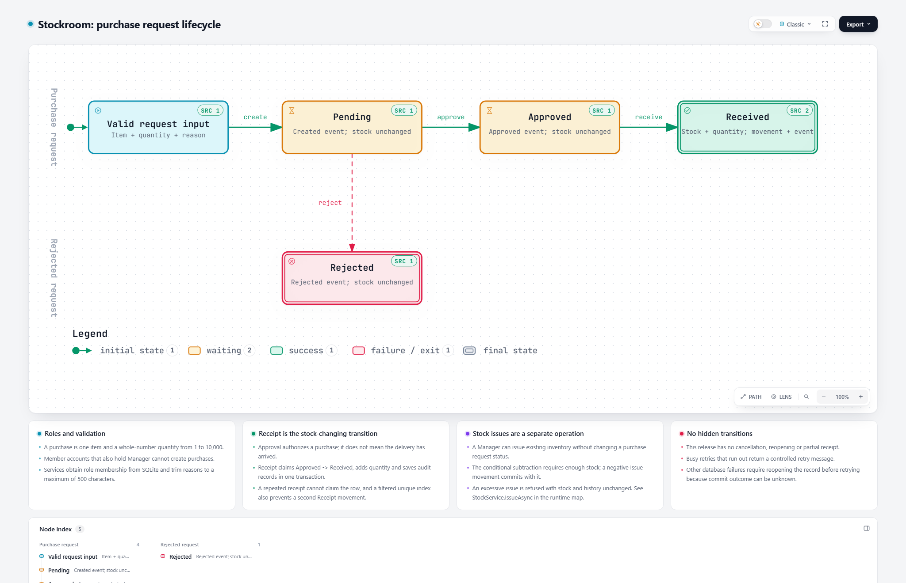
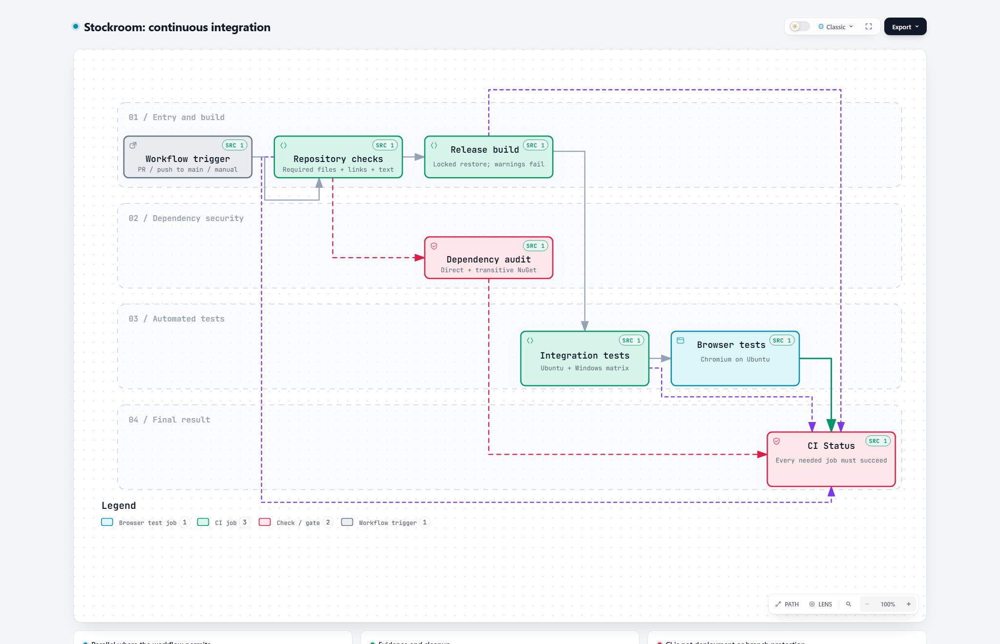

# Stockroom

Stockroom tracks supplies for a fictional campus makerspace. Members browse inventory and request purchases. A manager approves or rejects each request, records deliveries, issues stock, and reads a history of every change. The application uses C#, ASP.NET Core Razor Pages, Entity Framework Core, and SQLite, and runs locally with synthetic data.

## Walkthrough

An automated browser run captured these screenshots from a freshly seeded database. The accounts use the reserved `.test` domain.

1. A member's dashboard flags PLA filament: two spools against a reorder threshold of three.
   
2. The member requests five spools with a reason.
   
3. The manager opens the pending request and approves it. Stock stays at two.
   
4. The manager records the delivery. Stock rises to seven, once.
   
5. The manager issues two spools, then tries to issue six of the remaining five. The application refuses and changes nothing.
   
6. The history lists each request event and stock movement with its actor, UTC time, quantity change, and reason.
   

The [demo script](docs/releases/demo-script.md) narrates the full walkthrough, including the [manager dashboard](docs/images/03-manager-dashboard.png) and a [rejected request](docs/images/08-member-rejection.png). The interface also works at phone width and in dark mode; [ADR 0008](docs/decisions/0008-m8-ui-polish.md) shows both.

## Quick start

You need Git, PowerShell 7, and the [.NET 10 SDK](https://dotnet.microsoft.com/en-us/download/dotnet/10.0). From the repository root, choose two demo passwords with an uppercase letter, a lowercase letter, a digit, and a symbol:

```powershell
dotnet restore Stockroom.slnx --locked-mode
dotnet tool restore
dotnet user-secrets set "Seed:MemberPassword" "<member password>" --project src/Stockroom.Web
dotnet user-secrets set "Seed:ManagerPassword" "<manager password>" --project src/Stockroom.Web
dotnet run --project src/Stockroom.Web -- seed
dotnet run --project src/Stockroom.Web --launch-profile http
```

Open `http://localhost:5080` and log in as `member1@stockroom.test` or `manager@stockroom.test`. The [setup guide](docs/development/setup.md) describes the demo dataset, the `seed --reset` option, and each check.

## Architecture

One Razor Pages application handles every request: `Browser -> Razor Page -> C# service -> EF Core -> SQLite`, with ASP.NET Core Identity for accounts. The services own the business rules. Each stock change and its history record commit in one transaction, and conditional updates stop competing requests from adding a delivery twice or overselling. The [architecture page](docs/development/architecture.md) covers the records, transitions, and transaction design.



<details>
<summary>Data design, purchase lifecycle, and CI workflow</summary>

### Data design



### Purchase lifecycle



### CI workflow



</details>

The PNG previews are visible directly on GitHub. The [diagram guide](docs/diagrams/README.md) includes full-size images, interactive HTML files to open locally, and editable JSON sources.

## Tests

| Project | Cases | Covers |
| --- | --- | --- |
| [Integration](tests/integration/README.md) | 165 | Business rules, authorization, request ownership, transactions, races, rollback, lock handling, sessions, security-event logging, password hashing, seed, and reset against SQLite |
| [Browser](tests/e2e/README.md) | 11 | Purchase, rejection, withdrawal, access, restart persistence, phone layout, and keyboard focus in Chromium |
| [Unit](tests/unit/README.md) | 0 | Scaffold only; the integration tests cover the input rules |

Run the checks from the repository root:

```powershell
pwsh -NoProfile -File scripts/Test-Repository.ps1
pwsh -NoProfile -File scripts/Test-Dependencies.ps1
dotnet build Stockroom.slnx --configuration Release --no-restore --warnaserror
dotnet test --project tests/integration/Stockroom.IntegrationTests.csproj --configuration Release --no-build
pwsh tests/e2e/bin/Release/net10.0/playwright.ps1 install chromium
dotnet test --project tests/e2e/Stockroom.E2ETests.csproj --configuration Release --no-build
```

GitHub Actions runs the same checks as seven jobs, with integration tests on Ubuntu and Windows, and a final `CI Status` gate. The [test plan](docs/quality/test-plan.md) maps each acceptance scenario to its tests.

## Security

- The server checks each permission against the roles stored in the database, so a role change applies on the next request.
- Logout ends every session for the account, including copied cookies.
- Login allows five attempts per client address per one-minute sliding window, and an account locks after 11 failures.
- Every response carries a strict Content-Security-Policy and anti-framing headers.
- Database failures show a generic page and log the details on the server.

The [security review](docs/security/security-review.md) lists the M7 audit findings and their status. Report vulnerabilities through the [security policy](.github/SECURITY.md).

## Known limitations

- The application targets a local demonstration: no hosting configuration, HTTPS redirection, or HSTS.
- History and request lists have no paging.
- `seed --reset` deletes the database before reseeding; if seeding then failed, the database stays empty until the next reset.
- One client can lock an account after about 100 seconds of failed logins, and clients behind one address share the login limit. An active session renews without an absolute time limit.
- Item administration, multi-item orders, partial receipts, cancellations, stock corrections, suppliers, email, registration, and password recovery are outside the MVP.

The [draft v1.0.0 release notes](docs/releases/v1.0.0.md) list the release evidence and open items.

## Documentation

The [documentation index](docs/README.md) groups the planning, development, quality, security, and release documents. To contribute, read [CONTRIBUTING](.github/CONTRIBUTING.md); for questions, see [SUPPORT](.github/SUPPORT.md). Participation follows the [code of conduct](.github/CODE_OF_CONDUCT.md). The project uses the [MIT license](LICENSE).
