# ADR 0008: M8 interface polish

Date: 2026-10-04

Status: Accepted. Merged in pull request #8.

## Context

The M6 interface used browser-default styling. Every signed-in page scrolled sideways on a 390-pixel phone screen by 301 to 541 pixels, because the header and wide tables did not fit. Request status appeared only as plain text, the next permitted action on a request was not grouped, and the manager had no dashboard view of approved requests awaiting delivery. The redesign had to keep the Razor Pages structure, the server-side authorization, and the strict Content-Security-Policy from [ADR 0007](0007-m7-security-hardening.md).

## Decision

| Area | Decision |
| --- | --- |
| Visual style | One stylesheet (`wwwroot/css/site.css`) with colour tokens, following Apple's platform conventions rather than a generic dashboard template: grouped white surfaces on a light grey background with no borders or drop shadows, hairline separators, pill-shaped buttons, and one blue accent (`#0066cc` for links, 5.6:1 on white; `#0071e3` behind white button text, 4.6:1). Secondary actions use a solid blue tint instead of an outline. System fonts only; headings tighten their letter spacing as size grows. The CSP blocks external stylesheets and fonts, and no new dependency was added. |
| Light and dark | Every colour is a token with a dark-mode value under `prefers-color-scheme: dark`; `color-scheme: light dark` also themes form controls. `prefers-contrast: more` darkens separators and secondary text and outlines surfaces. |
| Header and feedback | From 56rem, where it fits on one row, the header is a sticky translucent bar (`backdrop-filter`) that content scrolls beneath, and `scroll-padding-top` keeps keyboard focus and anchor targets below it (WCAG 2.4.11). On narrower screens it wraps and scrolls away with the page; `prefers-reduced-transparency` makes it solid. Buttons scale to 97% while pressed. Motion is limited to that press and 150 ms colour changes, both of which `prefers-reduced-motion` turns off. |
| Status badges | `DisplayFormat.Badge` renders request statuses and actions as labelled badges: Pending (amber), Approved (blue), Rejected (red), Received (green), Created (grey). Inventory shows Low or OK. The text always names the state; colour only repeats it. |
| Page structure | Each page has a heading, one line of supporting text, and its primary action beside the heading. Supporting text that repeated a heading, button, or summary figure was removed. Empty states keep the existing messages in a plain panel. Record details are label and value rows divided by hairlines. |
| Dashboard | Summary figures for requests waiting for review, approved requests awaiting delivery, and low-stock items, each linking to its section. A new "Awaiting delivery" list (members: "Your approved requests") uses the existing `VisibleRequests` query with status Approved, so members still see only their own requests. Members get a Request button on low-stock rows. |
| Requests | Manager request lists add a Review or Record receipt button for Pending and Approved rows. The details page puts the record and a "Next step" panel side by side: approval and rejection for a pending request, receipt for an approved request, and a plain-language status explanation otherwise. |
| Forms | Fields have visible labels and hints linked through `aria-describedby`; invalid fields keep their values, gain a red border, and show the error beside the field and in the summary. The summary renders only when the form has errors, because the tag helper's empty summary emits an inline style that the CSP blocks. |
| Navigation | The header shows the account email and role. The navigation is a segmented control: the current section has `aria-current="page"`, a raised white segment, and a bolder label. On phones it moves to its own full-width row. |
| Tables on phones | Below 40rem, list tables (inventory, low stock, request lists) stack each row into a card that labels each value from a `data-label` attribute; the header row stays available to screen readers. History logs keep the table layout and scroll inside their own frame, which is focusable and named after the table heading. Timestamps do not wrap, so their card cell spans the full width. A table frame is positioned so visually hidden labels cannot widen the page. |

## Verification

`ResponsiveLayoutTests` checks at 390 pixels wide that 13 member and manager pages do not scroll sideways and log no console errors, which include CSP violations. A second test checks at 320 pixels that no stacked-card value is clipped; it failed with clipped timestamps until timestamp cells spanned the full card. A third tabs forward and backward through the manager history at 1280 and 900 pixels and follows a section anchor; it failed with a link hidden behind the header until `scroll-padding-top` was added. A fourth checks that the skip link is the first keyboard stop and that navigation marks one current section. Removing the table-frame positioning made the first test fail (5 pixels of sideways scrolling); adding an inline style made it fail with CSP errors. The explicit `UiScreenshots` case captures 19 pages at 1280 and 390 pixels, and at 1280 pixels in dark mode, and reports sideways overflow; selected before-and-after pairs are in [docs/images/ui-polish](../images/ui-polish).

| View | Before | After |
| --- | --- | --- |
| Manager dashboard | 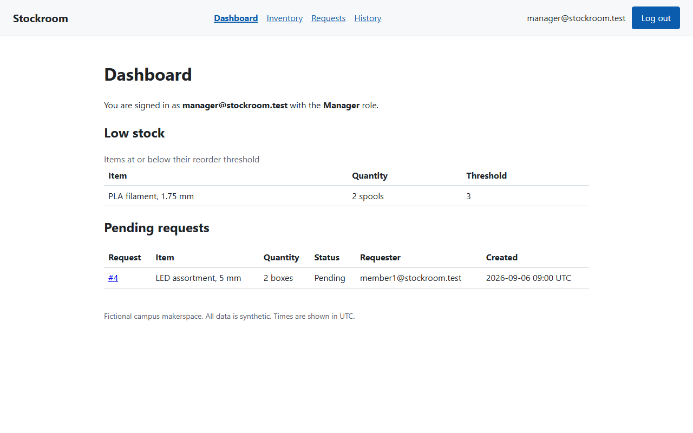 | 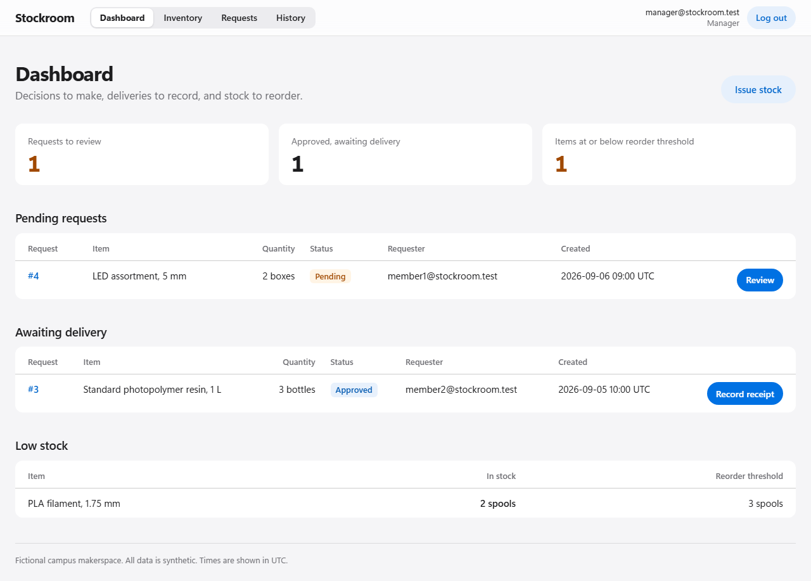 |
| Manager review | 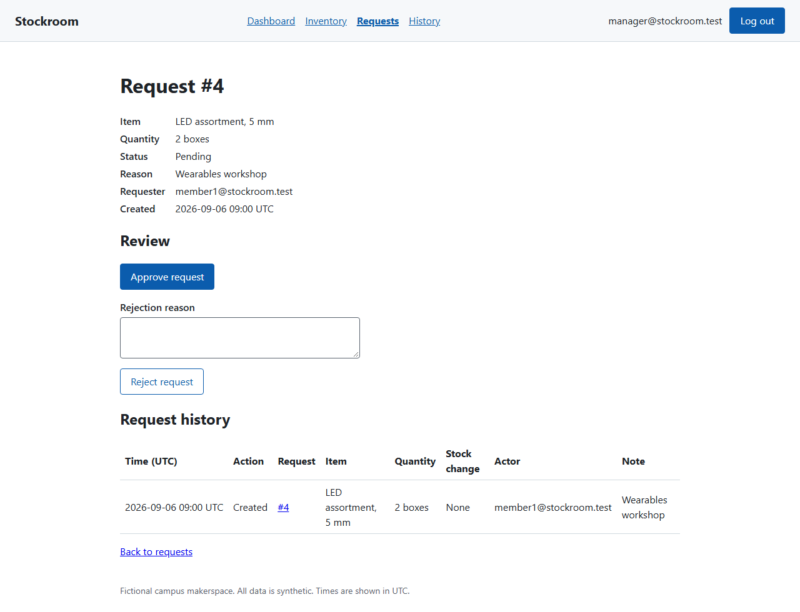 | 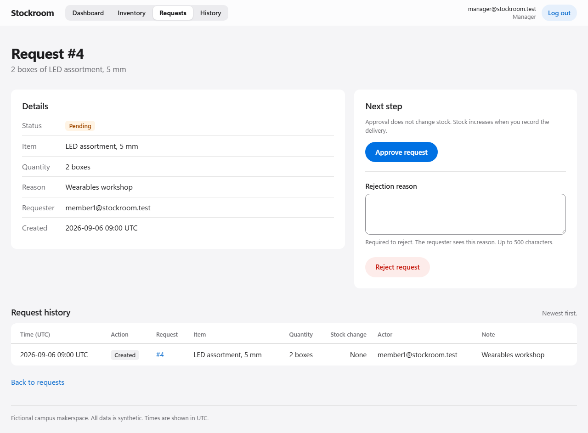 |
| Issue form errors | 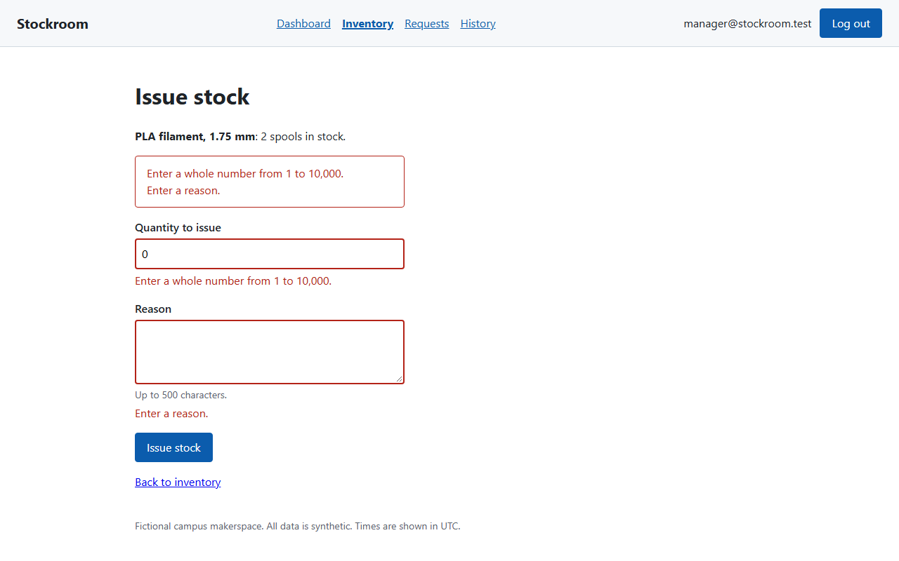 | 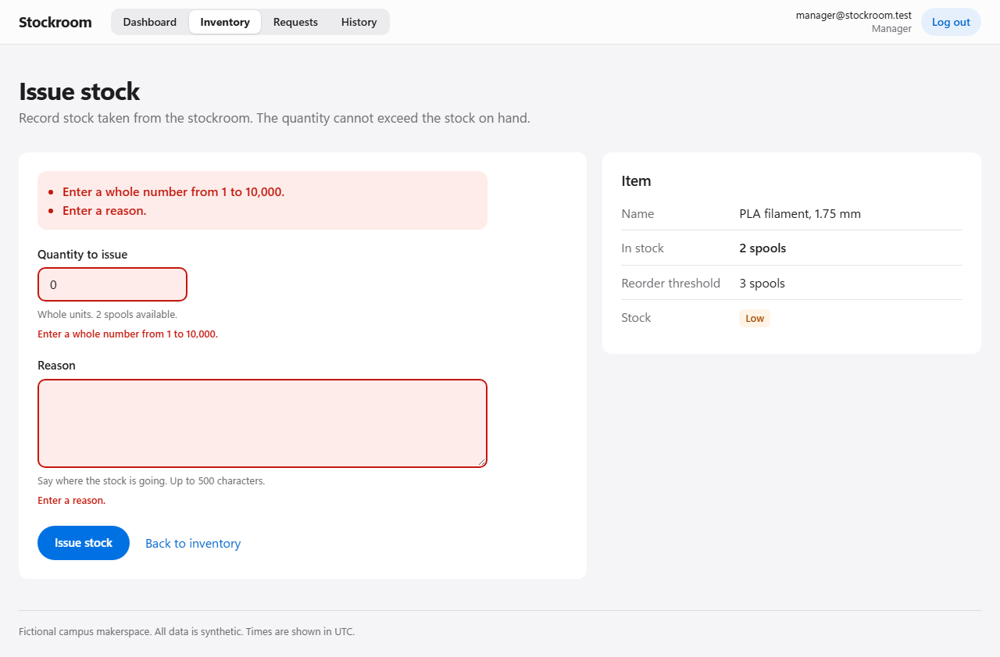 |
| Inventory at 390 px | 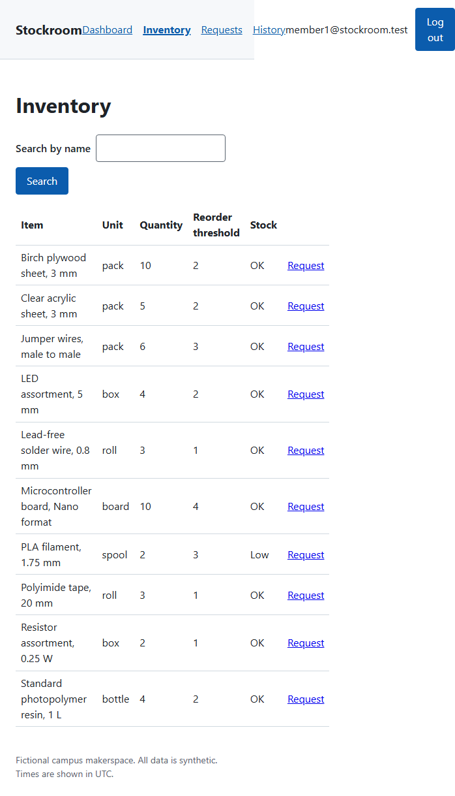 | 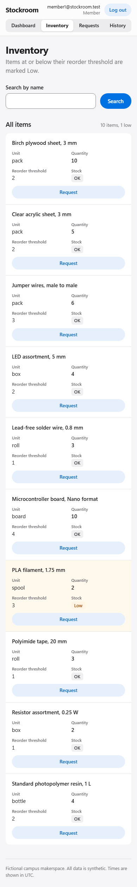 |
| Requests at 390 px | 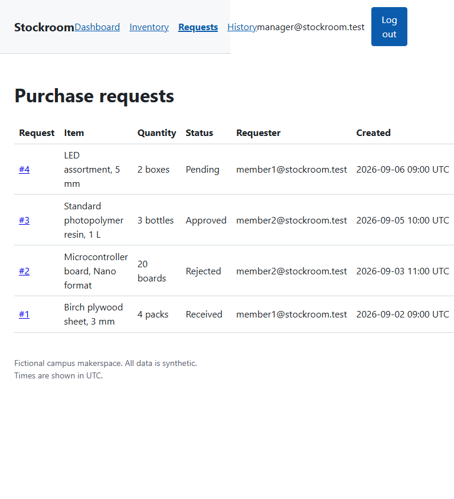 | 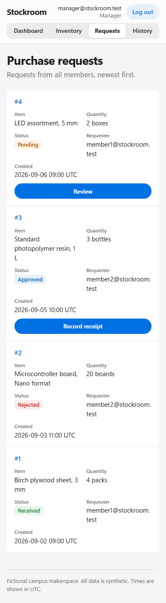 |
| History at 390 px | 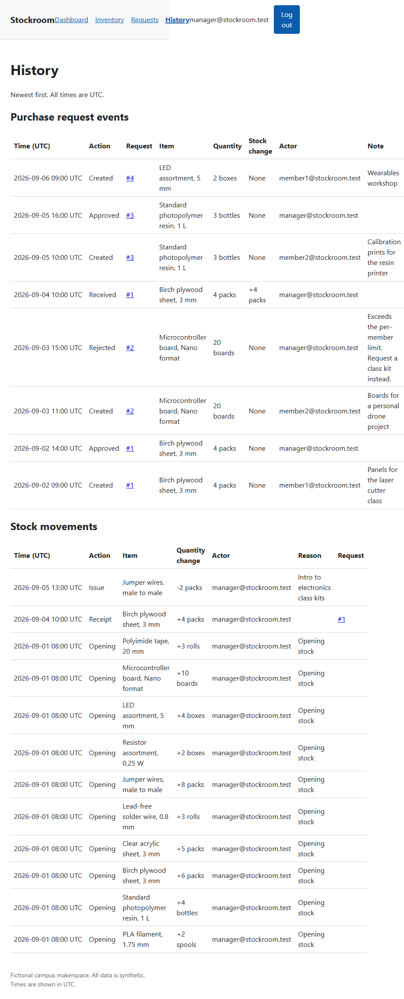 | 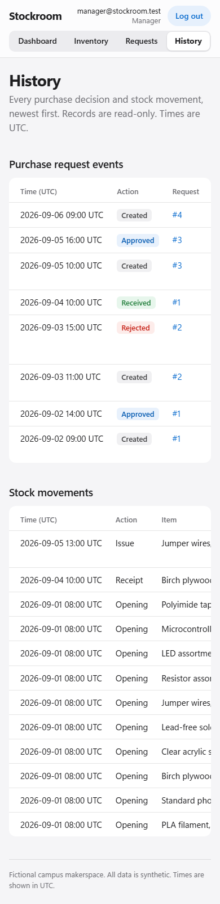 |

Dark mode, which had no earlier equivalent: [dashboard](../images/ui-polish/after-dark-desktop-12-manager-dashboard.png) and [review](../images/ui-polish/after-dark-desktop-15-manager-review.png).

## Consequences

- Five integration assertions that matched exact table markup now include the new classes and badge markup; each still checks the same values in the same order. The dashboard role assertion now reads the role from the header.
- Business services, authorization, antiforgery, transactions, session revocation, login throttling, and the CSP are unchanged.

## Limitations

- A blank rejection reason is still reported in the page-level alert after the redirect, not beside the rejection field.
- On phones, history tables scroll sideways inside their frame; the time, action, and request columns are visible first.
- Stacked phone cards change the table's CSS display. Chromium and Firefox keep table semantics; older Safari releases may announce the cards as plain text.
- The stacked cards show each column name twice to screen readers that read both the header and the generated label.
- Contrast was calculated from the token values for text, badges, and default and hover button states in both themes; every pair is at least 4.5:1, the lowest 4.66:1 (secondary text on the page background). No automated audit tool was run. Review found that two hover states failed (white on the dark-mode hover blue at 4.3:1, and blue on the secondary hover tint at 4.1:1 to 4.4:1); hover now darkens the fill or strengthens the text. Browser tests run in light mode only; dark mode was reviewed from screenshots.
- Browsers without `backdrop-filter` show the header as a near-opaque bar.
