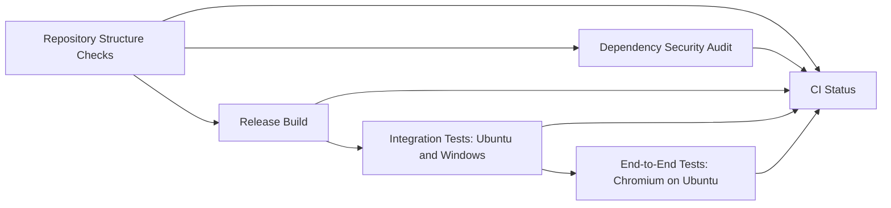

# Development setup

## Prerequisites

Contributors need Git, PowerShell 7, and a [.NET 10 SDK](https://dotnet.microsoft.com/en-us/download/dotnet/10.0), not a runtime alone. `global.json` selects SDK 10.0.401, allows later patches, and selects Microsoft.Testing.Platform for `dotnet test`.

The solution contains the web application in `src/Stockroom.Web/` and unit, integration, and E2E test projects. The integration and E2E projects contain test cases; the unit project has none.

## Local setup

Clone the repository, then run these commands from its root. Replace the placeholder passwords with values of your choice. Identity requires at least six characters, an uppercase letter, a lowercase letter, a digit, and a non-alphanumeric character.

```powershell
dotnet restore Stockroom.slnx --locked-mode
dotnet tool restore
dotnet user-secrets set "Seed:MemberPassword" "<member password>" --project src/Stockroom.Web
dotnet user-secrets set "Seed:ManagerPassword" "<manager password>" --project src/Stockroom.Web
dotnet run --project src/Stockroom.Web -- seed
dotnet run --project src/Stockroom.Web --launch-profile http
```

On 2026-10-04 the developer ran these commands on Windows 11 with SDK 10.0.401 in an isolated copy of the M9 tree: a clone with only the tracked files, a throwaway user-secrets store, generated passwords, and a new database inside the copy. The seed printed `Seed complete: 3 accounts, 10 items, 4 purchase requests, 12 stock movements.` twice, the manager logged in at `http://localhost:5080`, and every command under [Checks and tests](#checks-and-tests) passed: the repository and dependency checks, a Release build with no warnings, 156 integration tests, and 11 browser tests. Hosted CI has not run the M9 changes.

On a new database, the first seed prints an Entity Framework warning that an operation in the `StockMovementReasonAndReceiptChecks` migration cannot run in a transaction. SQLite rebuilds the `StockMovements` table to add CHECK constraints; the warning is expected and the seed continues.

On a new database, the seed command applies migrations to `src/Stockroom.Web/stockroom.db` and creates the demo dataset described below. On 2026-10-04 the developer ran it twice against a disposable database; both runs printed `Seed complete: 3 accounts, 10 items, 4 purchase requests, 12 stock movements.` A rerun adds only missing roles, accounts, and items and never changes or deletes existing records. A database seeded before M4 keeps its records and receives no example requests. Git ignores the database file. The command reads the environment from the launch profile and refuses to run outside Development:

```powershell
dotnet run --project src/Stockroom.Web --no-launch-profile -- seed
```

That command printed `The seed command runs only in Development. Current environment: Production. Nothing was changed.` and exited with code 1. Environment variables `Seed__MemberPassword` and `Seed__ManagerPassword` can replace user secrets.

Open `http://localhost:5080` and log in with one of the seeded accounts. Login accepts five attempts from one address per one-minute sliding window; further attempts show "Too many attempts" until the oldest ones leave the window, so up to 10 can fit within one minute. Logging out ends every session for that account.

| Account | Role | Password setting |
| --- | --- | --- |
| `member1@stockroom.test` | Member | `Seed:MemberPassword` |
| `member2@stockroom.test` | Member | `Seed:MemberPassword` |
| `manager@stockroom.test` | Manager | `Seed:ManagerPassword` |

### Demo dataset

All records are synthetic. Times are fixed UTC values in September 2026, so every fresh seed or reset produces the same dataset.

| Record | Contents |
| --- | --- |
| Accounts | member1@stockroom.test and member2@stockroom.test (Member), manager@stockroom.test (Manager) |
| Items | Ten items. Filament has two spools and a reorder threshold of three, the only low-stock item. |
| Request #1 | Member 1 requested four plywood packs; the manager approved and received it, raising plywood from six to ten. |
| Request #2 | Member 2 requested twenty microcontroller boards; the manager rejected it with a reason. |
| Request #3 | Member 2 requested three resin bottles; the manager approved it, and delivery is outstanding. |
| Request #4 | Member 1 requested two LED boxes; it is pending review. |
| Stock movements | Ten opening movements, the request #1 receipt (+4 plywood), and one issue of two jumper-wire packs for a class (8 to 6). Each item's quantity equals the sum of its movements. |

### Reset the demo database

**Reset permanently deletes the local demo database, including every request, stock change, and history record created since the last seed.** Stop the application first; on Windows a running application keeps the file open and the reset fails without changing anything.

```powershell
dotnet run --project src/Stockroom.Web -- seed --reset
```

The command runs only in Development. Before deleting anything, it checks that both seed passwords are set and meet the Identity password rules, that the data source is a plain local path ending in `.db`, and that an existing file can be read and is a SQLite database. It then deletes only the configured SQLite file. It refuses memory databases, URIs, wildcards, directories, and other files, then prints `Reset refused` and exits with code 1. After deleting the file, it applies the migrations and seeds the dataset above. On 2026-10-04 the developer ran reset against a disposable database: it printed the deleted path and `Seed complete: 3 accounts, 10 items, 4 purchase requests, 12 stock movements.` Outside Development, `--no-launch-profile -- seed --reset` exited with code 1, and a `.txt` data source was refused without creating or deleting a file. With `Seed__ManagerPassword=weak`, reset printed `Seed refused: Seed:ManagerPassword does not meet the password rules` and exited with code 1, and the database file's SHA-256 hash did not change.

## Checks and tests

```powershell
pwsh -NoProfile -File scripts/Test-Repository.ps1
pwsh -NoProfile -File scripts/Test-Dependencies.ps1
dotnet build Stockroom.slnx --configuration Release --no-restore
dotnet test --project tests/integration/Stockroom.IntegrationTests.csproj --configuration Release --no-build
pwsh tests/e2e/bin/Release/net10.0/playwright.ps1 install chromium
dotnet test --project tests/e2e/Stockroom.E2ETests.csproj --configuration Release --no-build
```

The application writes errors, including database failures, to the console log; the browser shows a generic error page without details. The browser tests start the Release build of the web application on a temporary database; see [the E2E README](../../tests/e2e/README.md). The integration tests host the application with `WebApplicationFactory` and give each test its own temporary SQLite file. The repository check covers tracked files only, so add new files to Git before relying on its result.

To refresh the README screenshots and record the walkthrough video, build the solution and run the explicit demo test. It uses its own temporary database and writes screenshots to `docs/images` and video to the ignored `artifacts/demo` directory. The explicit `UiScreenshots` case writes interface review screenshots to the ignored `artifacts/ui` directory in the same way.

```powershell
dotnet test --project tests/e2e/Stockroom.E2ETests.csproj --configuration Release --no-build -- --explicit only --filter-class Stockroom.E2ETests.DemoRecording
```

## Migrations

After changing the model in `src/Stockroom.Web/Data/AppDbContext.cs`, add a migration with the pinned tool:

```powershell
dotnet ef migrations add <Name> --project src/Stockroom.Web --output-dir Data/Migrations
```

The tool writes files with a byte-order mark and CRLF line endings. Convert them to UTF-8 without a BOM and LF line endings before running the repository check.

Keep source under `src/Stockroom.Web/` and tests under `tests/`. Do not add placeholder commands to the README as working setup instructions.

## Dependency management

Use [tests/README.md](../../tests/README.md) for project responsibilities. `Directory.Packages.props` contains direct package versions, and each project has a `packages.lock.json`. `Directory.Build.props` enables NuGet Audit for direct and transitive packages at low severity and above. `NuGet.Config` uses the official package and audit sources.

To change packages, edit the central versions, run `dotnet restore Stockroom.slnx --force-evaluate`, inspect lock-file changes, then run `scripts/Test-Dependencies.ps1`. The script restores in locked mode and fails on source errors or advisories. A fresh checkout needs network access to NuGet and its audit feed. Build after changing versions.

## Repository checks and CI

`scripts/Test-Repository.ps1` checks required project documents, UTF-8 text, LF line endings, trailing whitespace, final newlines, and local Markdown file targets among tracked files. Each link must match the tracked path's exact case, because Linux and GitHub treat `Setup.md` and `setup.md` as different files. NuGet generates lock files with platform-specific line endings and no final newline, so the checker exempts those files from these two formatting checks. Git normalizes their committed line endings. The checker does not inspect remote URLs, Markdown anchors, or prose quality.

The [CI workflow](../../.github/workflows/ci.yml) starts on pushes to `main`, pull requests targeting `main`, and manual dispatch. Each check has a separate job in GitHub's workflow graph:



| Job | Verification |
| --- | --- |
| Repository Structure Checks | Required tracked files, text formatting, and local Markdown links |
| Dependency Security Audit | Locked package restore and the existing four-project NuGet audit |
| Release Build | Full solution build with compiler and analyzer warnings treated as errors |
| Integration Tests | SQLite and HTTP cases on Ubuntu and Windows; at least one test must run |
| End-to-End Tests | Chromium browser cases on Ubuntu against the web application started by the test fixture; at least one test must run |
| CI Status | Every required job must succeed; failure, cancellation, and skipped dependencies cannot produce a passing gate |

The audit and Release build run in parallel after repository checks pass. Integration tests start after the build. Their runners restore locked packages and build their own test host because jobs have separate filesystems and the two operating systems need their own binaries. SDK setup caches NuGet packages using the project lock files.

The End-to-End job starts after both integration runs pass. It builds the web application and browser tests in separate steps, so either failed build fails the job, installs Chromium with its Linux dependencies, and uploads the TRX report plus any failure traces, screenshots, and server logs. Integration and browser runs upload TRX reports and test diagnostics as separate artifacts, retained for 14 days. Reports are uploaded after passing or failing test runs. Matrix failures do not cancel the other operating system's tests. `CI Status` records the job results in the run summary. Set that check as required in the `main` branch rules after its first hosted run.

The workflow has read access to repository contents and does not deploy.

Run the local commands above before pushing. Hosted run [37184964723](https://github.com/AdityaJadhav17/Stockroom/actions/runs/37184964723) passed every job on `main` at the M8 merge.

Add a unit-test job when the unit project contains cases. A scaffold build proves no business behavior, and the dependency audit covers known NuGet advisories rather than downloaded browser binaries.

References: [NuGet audit](https://learn.microsoft.com/en-us/nuget/concepts/auditing-packages), [GitHub job dependencies](https://docs.github.com/en/actions/how-tos/write-workflows/choose-what-workflows-do/use-jobs), [SDK setup and caching](https://github.com/actions/setup-dotnet), [xUnit test reports](https://xunit.net/docs/getting-started/v3/microsoft-testing-platform), and [artifact uploads](https://github.com/actions/upload-artifact).
